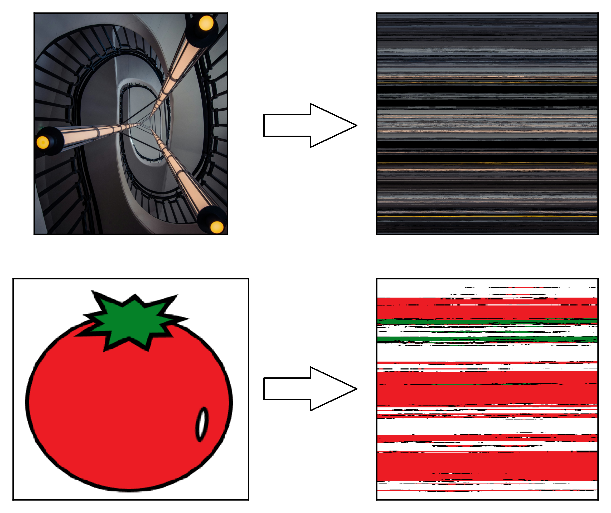

# Making Hilbert Curve from image
* In `curve.py`  Python code to convert RGB or grayscale image to **Hilbert Space-Filling Curve** (also works with PNG)
* In `example.ipynb` example of usage with visualization
* #### ⭐Star the repo, if you like it!⭐
## Prerequisites:
```bash
pip install numpy numpy-hilbert-curve
```
For running `example.ipynb`:
```bash
pip install -r requirements.txt
```


## Visualization
* Original images(left), and reshaped Hilbert Curve images(right)
* Because Hilbert Curve is 1-d(its length), line was reshaped to square to represent as image


## Acknowledges
* Hilbert curve coordinates generator:  [GitHub](https://github.com/PrincetonLIPS/numpy-hilbert-curve), [PyPI](https://pypi.org/project/numpy-hilbert-curve/)

* Stairs Photo by <a href="https://unsplash.com/@paolobendandi?utm_content=creditCopyText&utm_medium=referral&utm_source=unsplash">Paolo Bendandi</a> on <a href="https://unsplash.com/photos/a-spiral-staircase-with-three-lights-on-each-of-it-qxnF7PHDEjI?utm_content=creditCopyText&utm_medium=referral&utm_source=unsplash">Unsplash</a>
* Tomato image by Me😎
